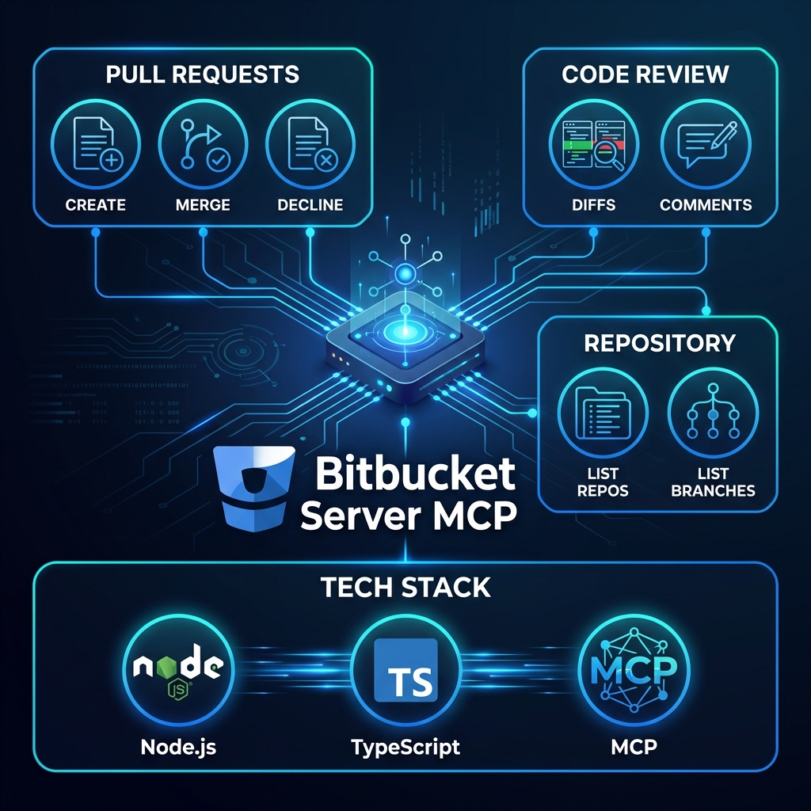

# Bitbucket Server MCP



MCP (Model Context Protocol) server for Bitbucket Server Pull Request management. This server provides tools and resources to interact with the Bitbucket Server API through the MCP protocol.

## Requirements

- Node.js >= 16

## Installation

### Manual Installation
```bash
npm install
```

## Build

```bash
npm run build
```

## Features

The server provides the following tools for Bitbucket Server integration:

### `create_pull_request`

Creates a new pull request.

Parameters:

- `project`: Bitbucket project key (defaults to BITBUCKET_DEFAULT_PROJECT if set)
- `repository` (required): Repository slug
- `title` (required): PR title
- `description`: PR description
- `sourceBranch` (required): Source branch name
- `targetBranch` (required): Target branch name
- `reviewers`: Array of reviewer usernames

### `get_pull_request`

Retrieves detailed information about a specific pull request.

Parameters:

- `project`: Bitbucket project key (defaults to BITBUCKET_DEFAULT_PROJECT if set)
- `repository` (required): Repository slug
- `prId` (required): Pull request ID

### `merge_pull_request`

Merges a pull request.

Parameters:

- `project`: Bitbucket project key (defaults to BITBUCKET_DEFAULT_PROJECT if set)
- `repository` (required): Repository slug
- `prId` (required): Pull request ID
- `message`: Merge commit message
- `strategy`: One of:
  - `merge-commit` (default)
  - `squash`
  - `fast-forward`

### `decline_pull_request`

Declines a pull request.

Parameters:

- `project`: Bitbucket project key (defaults to BITBUCKET_DEFAULT_PROJECT if set)
- `repository` (required): Repository slug
- `prId` (required): Pull request ID
- `message`: Reason for declining

### `add_comment`

Adds a comment to a pull request.

Parameters:

- `project`: Bitbucket project key (defaults to BITBUCKET_DEFAULT_PROJECT if set)
- `repository` (required): Repository slug
- `prId` (required): Pull request ID
- `text` (required): Comment text
- `parentId`: Parent comment ID for replies

### `get_diff`

Retrieves the diff for a pull request.

Parameters:

- `project`: Bitbucket project key (defaults to BITBUCKET_DEFAULT_PROJECT if set)
- `repository` (required): Repository slug
- `prId` (required): Pull request ID
- `contextLines`: Number of context lines (default: 10)

### `get_reviews`

Fetches the review history of a pull request, including approvals and reviews.

Parameters:

- `project`: Bitbucket project key (defaults to BITBUCKET_DEFAULT_PROJECT if set)
- `repository` (required): Repository slug
- `prId` (required): Pull request ID

### `list_repositories`

Lists repositories in a project.

Parameters:

- `project`: Bitbucket project key (defaults to BITBUCKET_DEFAULT_PROJECT if set)

### `list_branches`

Lists branches in a repository.

Parameters:

- `project`: Bitbucket project key (defaults to BITBUCKET_DEFAULT_PROJECT if set)
- `repository` (required): Repository slug

## Dependencies

- `@modelcontextprotocol/sdk` - SDK for MCP protocol implementation
- `axios` - HTTP client for API requests
- `winston` - Logging framework

## Configuration

The server requires configuration in the VSCode MCP settings file. Here's a sample configuration:

```json
{
  "mcpServers": {
    "bitbucket": {
      "command": "node",
      "args": ["/path/to/bitbucket-server/build/index.js"],
      "env": {
        "BITBUCKET_URL": "https://your-bitbucket-server.com",
        // Authentication (choose one):
        // Option 1: Personal Access Token
        "BITBUCKET_TOKEN": "your-access-token",
        // Option 2: Username/Password
        "BITBUCKET_USERNAME": "your-username",
        "BITBUCKET_PASSWORD": "your-password",
        // Optional: Default project
        "BITBUCKET_DEFAULT_PROJECT": "your-default-project"
      }
    }
  }
}
```

### Environment Variables

- `BITBUCKET_URL` (required): Base URL of your Bitbucket Server instance
- Authentication (one of the following is required):
  - `BITBUCKET_TOKEN`: Personal access token
  - `BITBUCKET_USERNAME` and `BITBUCKET_PASSWORD`: Basic authentication credentials
- `BITBUCKET_DEFAULT_PROJECT`: Default project key to use when not specified in tool calls

## Logging

The server logs all operations to `bitbucket.log` using Winston for debugging and monitoring purposes.
